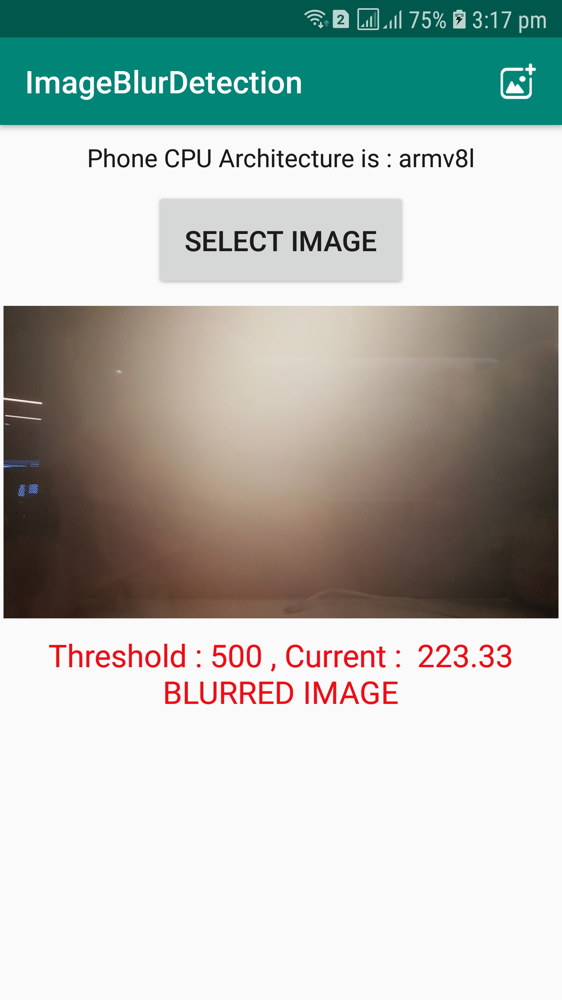
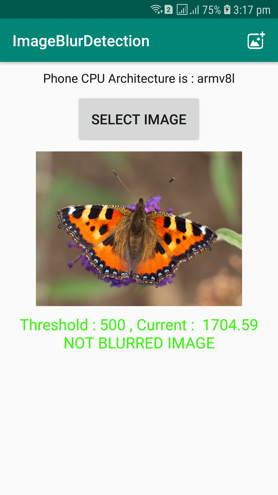
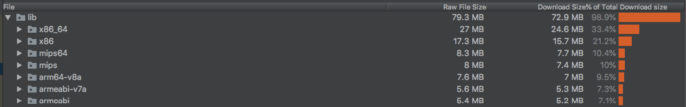

# ImageBlur Detection

To check whether an image is blurred or not in Android. Image should be selected from Gallery.

**OpenCV library is used for Blur detection.**

Download OpenCV by selecting a stable version of Android pack from [here](https://opencv.org/releases.html).
Integrating OpenCV to studio-project is quite a long procedure. Please refer this [awesome](https://medium.com/@sukritipaul005/a-beginners-guide-to-installing-opencv-android-in-android-studio-ea46a7b4f2d3) article.

#### Threshold value
If the sharpness of image is lesser than this value, then that image is marked as blurred.


#### Screenshots
Blurred Image | Not Blurred Image
------------ | -------------
 | 


#### APK Size
APK size is the main concern when we want to integrate with OpenCV.


* Debug APK size -  86 MB
* Debug APK size with Progaurd - 84.4 MB
* Debug APK size with Progaurd and R8 - 80 MB
* Debug APK size with Progaurd + R8 + NDK abiFilters(including only _armv7_ and _x86_)  - 24 MB


#### Workaround to minimise apk size
* Splitting apks by including only those architectures that we need to support. Also include universal apk.
```groovy
 splits {
            abi {
                enable true
                reset()
                include "armeabi-v7a","x86"
                universalApk true
            }
        }
 ```
 * Creating an apk according to w.r.t architectures included. Also including universal apk.
 ```groovy
 ext.versionCodes = ['armeabi-v7a': 4, 'x86': 5]
 import com.android.build.OutputFile
 android.applicationVariants.all { variant ->
     variant.outputs.each { output ->
         def abiFilter = output.getFilter(OutputFile.ABI)
         def abiMultiplier = 0
         if (abiFilter != null) {
             abiMultiplier = project.ext.versionCodes.get(abiFilter)
         }
         output.versionCodeOverride = abiMultiplier * 1000 + android.defaultConfig.versionCode
     }
 }
 ```

**Problem** with this approach is we have to upload all the apks separately for google play console, including univeral apk. [Credits](https://stackoverflow.com/a/45074929/5785930)

#### Factors which decides the quality of an Image
*  **Mega Pixels of Camera** - Doesn’t necessarily impact image quality, more MP!=more quality.
*  **Camera Sensor quality** - Hardware component which decides image quality. Better sensor will result in better picture quality.
*  **Pixel Size** - more pixel size will give more picture quality. 16MP Samsung S5 and S6 has 1.12µm but 12MP Samsung S7 has 1.4µm.
*  **Aperture** - Hole/Opening in the Camera through which light travels. Larger apertures are better, To control the amount of light reaching the image sensor. 
*  **Shutter Speed** - Length of time with which sensor is exposed to light. More shutter speed is, the more light is available to focus.
Ex : For moving objects, slower SP results in blurred images
*  **Image Size** - Doesn’t necessarily impact image quality, more image size!=more quality.

#### How to decide threshold value?

Threshold is a critical parameter to verify the blurriness of image.
* Too small of a value, and you’ll accidentally mark images as blurry when they are not.
* With too large of a threshold, you’ll mark images as non-blurry when in fact they are.
[Credits](https://www.pyimagesearch.com/2015/09/07/blur-detection-with-opencv/)

#### So finally, What value to use for threshold?
It all depends on the dataset of images. Currently we are keeping it as **500**.

#### Useful info
According to [stats](https://stackoverflow.com/a/33230181/5785930), armv7 is the most commonly used android architectures.